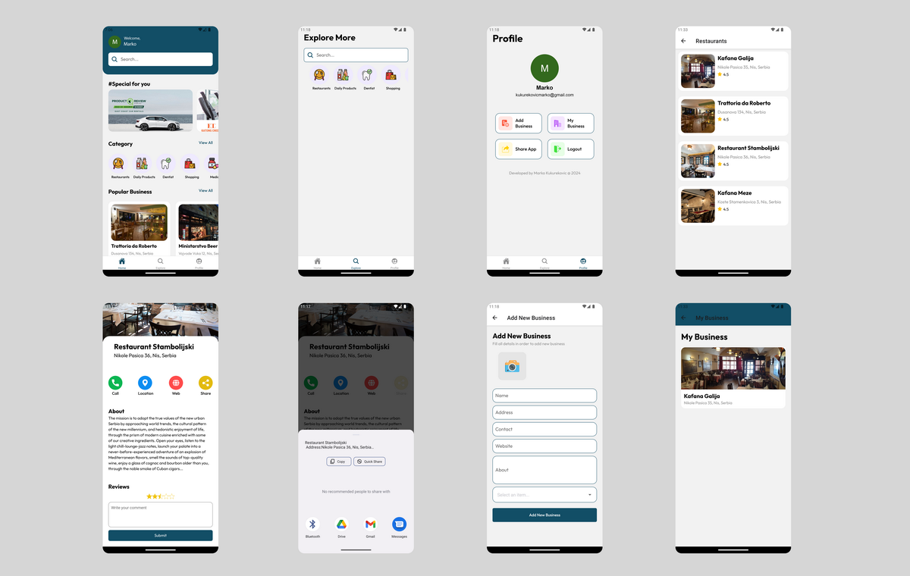

# DirectoryHub

Welcome to DirectoryHub, the ultimate platform connecting you to a diverse array of businesses across various categories. Whether you're searching for a cozy cafe, a reliable mechanic, a cutting-edge tech store, or a trusted healthcare provider, DirectoryHub has you covered.

## Demo

The .apk file of this project can be found at https://

## Preview

## Features

Here's what you can do with this user-friendly application:

- Easy Login: Sign in effortlessly with your Google account.
- Explore Categories: Discover businesses sorted into convenient categories.
- Add New Businesses: Easily add new businesses to the directory.
- Manage Your Listings: Keep track of and update the businesses you’ve added.
- Instant Actions: Quickly call, locate, visit the website, or share any business with a tap.
- User Reviews & Ratings: Read and write real reviews and ratings from other users to make informed choices.

DirectoryHub makes it easy to discover and connect with local businesses that meet your needs.

## Tech Stack

This app was built with:

- React Native
- Expo Router
- Firebase
- Clerk